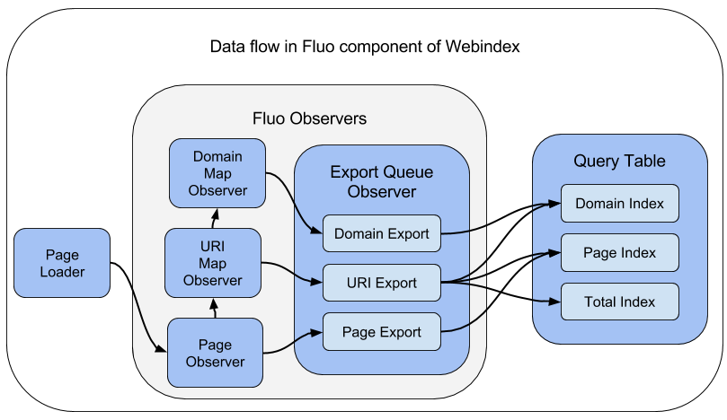

# Code Guide

The Webindex example has three major code components.

 * Spark component :  Generates initial Fluo and Query [tables].
 * Fluo component :  Updates the [Query table][qt] as web pages are added, removed, and updated.
 * Web component : Web application that uses the [Query table][qt]. 

Since all of these components either read or write the Query table, you may
want to read about the [Query Table][qt] before reading about the code.

## Guide to Fluo Component.

The following image shows a high level view of how data flows through the Fluo
Webindex code.   

<!--
The image was produced using Google Docs.  A link to the source is here.
https://docs.google.com/drawings/d/1vl26uXtScXn1ssj3WEb-qskuH-15OOmWul1B562oWDc/edit?usp=sharing
-->

### Page Loader

The [PageLoader] queues updated page content for processing by the [PageObserver].

### Observer Provider

All Observers are setup by [WebindexObservers].  This class wires up everything discussed below.

### Page Observer

The [PageObserver] computes changes to links in a page.  It queues `+1` and `-1`  for  new and
deleted URIs to the uriQ.  It also queues up changes in URIs to the export queue.

### URI Combine Queue

A CombineQueue is setup to track the number of pages linking to a URI.  The `reduce()` function in
[UriInfo] combines multiple updates into a single value.
[UriCombineQ.UriUpdateObserver][UriCombineQ] is called when a keys values changes.  The update
observer queues '+1' and '-1' to the domain map.  The update observer also queues change in URI
inbound link counts to the export queue.

### Domain Combine Queue

A CombineQueue is setup to track the number of unique URIs observed in each domain.  The
SummingCombiner from Fluo Recipes combines updates.
[DomainCombineQ.DomainUpdateObserver][DomainCombineQ] is called when
a keys value changes and it queues the changes on the export queue. 

### Export Queue

All other observers place [IndexUpdate] observers on the export queue. [IndexUpdateTranslator] is a
function that translates [IndexUpdate]s to Accumulo Mutations.  This function is passed to the Fluo
Recipe that exports to Accumulo tables. 
 
[IndexUpdate] is is implemented by the following classes:

1. [DomainUpdate] - Updates information related to domain (like page count).

2. [PageUpdate] - Updates information related to page (like links being added or deleted).

3. [UriUpdate] - Updates information related to URI.

These objects are translated to mutations using code in the [IndexClient].

[PageLoader]: ../modules/data/src/main/java/webindex/data/fluo/PageLoader.java
[PageObserver]: ../modules/data/src/main/java/webindex/data/fluo/PageObserver.java
[WebindexObservers]: ../modules/data/src/main/java/webindex/data/fluo/WebindexObservers.java
[UriCombineQ]: ../modules/data/src/main/java/webindex/data/fluo/UriCombineQ.java
[DomainCombineQ]: ../modules/data/src/main/java/webindex/data/fluo/DomainCombineQ.java
[IndexUpdateTranslator]: ../modules/data/src/main/java/webindex/data/fluo/IndexUpdateTranslator.java
[IndexUpdate]: ../modules/core/src/main/java/webindex/core/models/export/IndexUpdate.java
[DomainUpdate]: ../modules/core/src/main/java/webindex/core/models/export/DomainUpdate.java
[PageUpdate]: ../modules/core/src/main/java/webindex/core/models/export/PageUpdate.java
[UriUpdate]: ../modules/core/src/main/java/webindex/core/models/export/UriUpdate.java
[UriInfo]: ../modules/core/src/main/java/webindex/core/models/UriInfo.java
[IndexClient]: ../modules/core/src/main/java/webindex/core/IndexClient.java
[qt]: tables.md#query-table-schema
[tables]: tables.md

